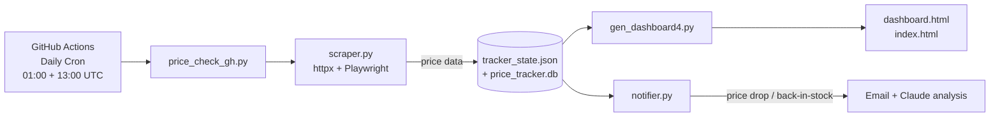

# Product Price Tracker

Self-hosted price tracker that monitors product pages, stores price history, and emails you with a Claude-powered buy/wait analysis when a price drops.

  

---

## Overview

Product Price Tracker scrapes prices from Tecovas, Quince, Shopify stores, and other retailers on a twice-daily schedule driven by GitHub Actions. Each run saves results to a flat JSON state file (`tracker_state.json`) and an optional SQLite database, detects price drops and back-in-stock events, and sends an email alert containing a buy/wait recommendation generated by Claude (`claude-haiku-4-5`). A static HTML dashboard (`index.html`) is regenerated after every run and published to GitHub Pages so you always have a live view of price history charts.

---

## Architecture / How It Works



**Run order per GitHub Actions job:**
1. `price_check_gh.py` — iterates all active products, scrapes each, appends to `tracker_state.json`
2. `gen_dashboard4.py` — reads state file and regenerates `dashboard.html`
3. `cp dashboard.html index.html` — promotes to GitHub Pages root
4. `git commit && git push` — only if any file changed

---

## Tech Stack

- **Language**: Python 3.11+
- **HTTP scraping**: `httpx` + `BeautifulSoup4` (Quince, generic Shopify)
- **JS scraping**: `playwright` headless Chromium (Tecovas and JS-heavy stores)
- **Amazon (optional)**: Rainforest API — set `RAINFOREST_API_KEY` to enable; falls back to Playwright stealth
- **State / history**: `tracker_state.json` (GitHub Actions source of truth) + `price_tracker.db` (SQLite, local dev)
- **Notifications**: `smtplib` via Gmail App Password
- **AI analysis**: Claude API — `claude-haiku-4-5` for buy/wait recommendations
- **Dashboard**: static `dashboard.html` with Chart.js line charts, served via GitHub Pages
- **Scheduling**: GitHub Actions cron + `workflow_dispatch`
- **Config**: `python-dotenv`

---

## Quick Start

```bash
# 1. Install dependencies
pip install -r requirements.txt
playwright install chromium

# 2. Copy and fill in secrets
cp .env.example .env   # edit: SMTP_USER, SMTP_PASSWORD, ANTHROPIC_API_KEY, etc.

# 3. Initialise the local SQLite DB (optional — only needed for local runs)
python db.py

# 4. Run a one-off price check locally
python price_check_gh.py

# 5. Regenerate the dashboard
python gen_dashboard4.py && open dashboard.html
```

> For CI: add all secrets from the **Configuration / Secrets** section to your GitHub repo's Settings → Secrets and variables → Actions.

---

## Key Scripts

| File | Purpose |
|---|---|
| `price_check_gh.py` | GitHub Actions entry point — iterates `tracker_state.json`, scrapes all active products, detects drops and back-in-stock events, triggers notifications |
| `scraper.py` | Scraper layer — routes by retailer: Playwright headless for Tecovas; `httpx`+BeautifulSoup for Quince/Shopify/generic; returns a standardised `{title, price, currency, image_url, in_stock, raw}` dict |
| `notifier.py` | Sends price-drop and back-in-stock emails via `smtplib`; calls Claude API for buy/wait analysis |
| `gen_dashboard4.py` | Reads `tracker_state.json` and renders `dashboard.html` with Chart.js price history charts; product images stored as base64 |
| `db.py` | SQLite helpers for local development — `init_db()`, `add_product()`, `add_price_history()`, `get_active_products()` |
| `price_check.py` | Local single-product check (dev/test use) |
| `unfollow_product.py` | Sets `active: false` on a product in `tracker_state.json` to stop tracking it |

---

## Project Structure

```
ProductPriceTracking/
├── .github/
│   └── workflows/
│       └── price_check.yml     # Cron job definition
├── scraper.py                  # Scraping layer
├── notifier.py                 # Email + Claude alerts
├── price_check_gh.py           # CI entry point
├── price_check.py              # Local single-product runner
├── gen_dashboard4.py           # Dashboard generator
├── db.py                       # SQLite helpers
├── unfollow_product.py         # Stop-tracking utility
├── tracker_state.json          # Products + price history (committed)
├── dashboard.html              # Generated dashboard
├── index.html                  # GitHub Pages root (copy of dashboard.html)
├── _img_*.b64                  # Base64-encoded product images
├── requirements.txt
└── .env                        # Local secrets (gitignored)
```

---

## Configuration / Secrets

Create a `.env` file at the project root (never commit it):

```env
# Scraping
RAINFOREST_API_KEY=           # Optional — enables Rainforest API for Amazon products

# Notifications
NOTIFY_EMAIL=                 # Recipient address for price alerts
SMTP_HOST=smtp.gmail.com
SMTP_PORT=465
SMTP_USER=                    # Gmail address used to send alerts
SMTP_PASSWORD=                # Gmail App Password (not your account password)

# Claude API
ANTHROPIC_API_KEY=            # Used by notifier.py for buy/wait analysis

# Local DB (optional)
DB_PATH=./price_tracker.db
```

For GitHub Actions, add each of the above (except `DB_PATH`) as a repository secret under **Settings → Secrets and variables → Actions**.

---

## Automation

The workflow in `.github/workflows/price_check.yml` runs on two triggers:

| Trigger | Schedule |
|---|---|
| Cron | `0 1,13 * * *` — 01:00 and 13:00 UTC (approximately 6:30 AM and 6:30 PM IST) |
| Manual | `workflow_dispatch` — "Run workflow" button in the GitHub Actions UI |

**What the job does:**
1. Checks out the repo and installs Python 3.11 + dependencies + Playwright Chromium
2. Runs `price_check_gh.py` with all secrets injected as environment variables
3. Regenerates `dashboard.html` via `gen_dashboard4.py`
4. Copies `dashboard.html` → `index.html` for GitHub Pages
5. Commits and pushes `tracker_state.json`, `index.html`, and `dashboard.html` only if content changed

The workflow requires `contents: write` permission to push the updated files back to the repo.

---

## Notes

- **`price_tracker.db`** is SQLite and local only — it is gitignored and not used by the GitHub Actions pipeline. The CI pipeline uses `tracker_state.json` as its source of truth.
- **Product images** (`_img_*.b64`) are stored as base64-encoded strings so the dashboard renders correctly without external image hosting.
- **Rate limiting**: the scraper sleeps 3–7 seconds between products to avoid triggering bot detection.
- **Out-of-stock**: `price` is stored as `null` when a variant is unavailable; drop detection is skipped until the item is back in stock.
- **Cloudflare / bot walls**: if Playwright is blocked on a Shopify store, escalate to Zyte API or ScraperAPI (not currently wired in by default).
